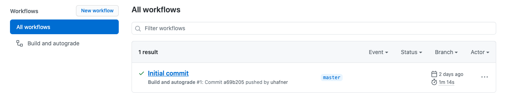
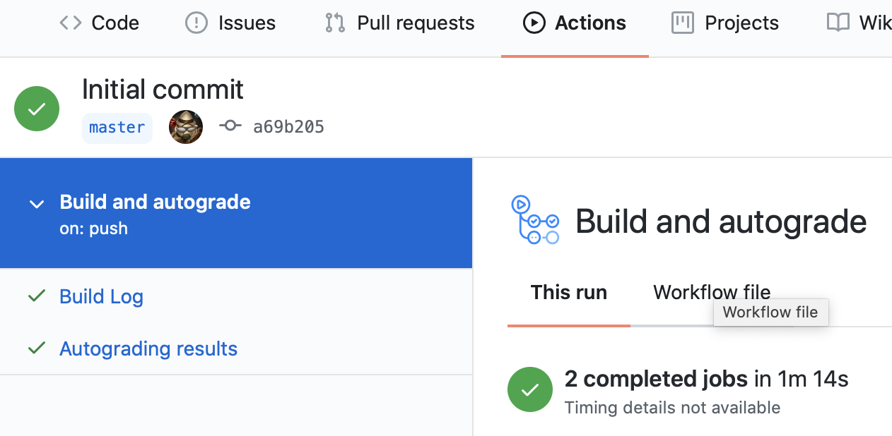
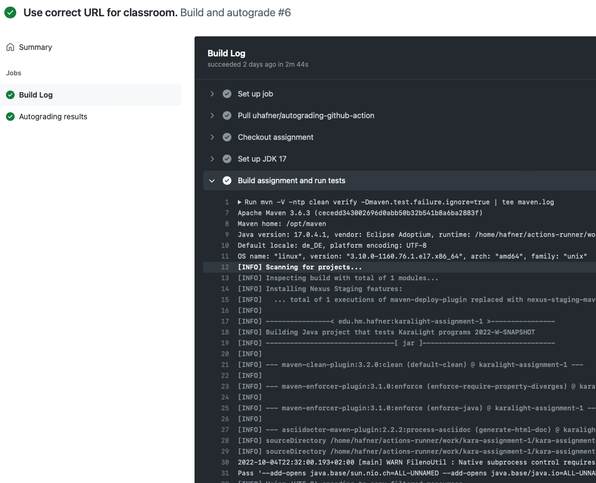
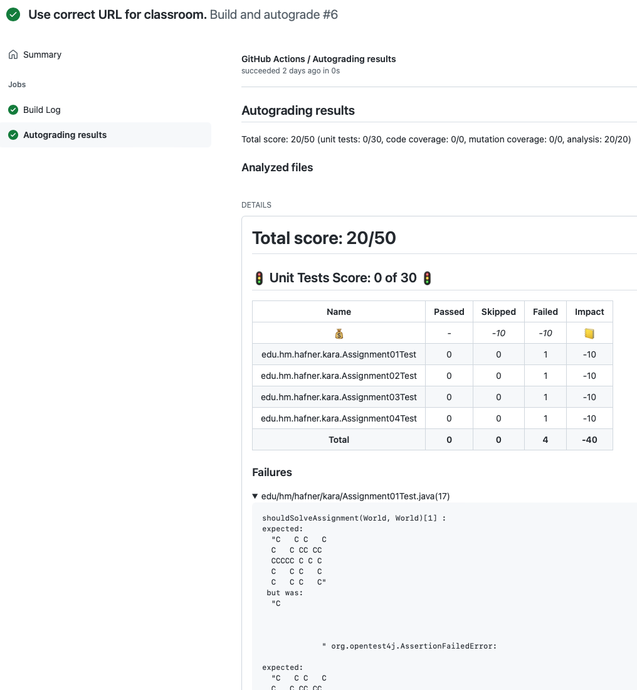

# Hinweise zu den Abgaben in Softwareentwicklung I

## Software installieren

In diesem Semester benötigen wir zunächst das Tool [GreenFoot](https://www.greenfoot.org/download), 
um unsere Programme mit Kara zu editieren und auszuführen. Um die Java Programme dabei zu übersetzen brauchen wir auch
Java 11. Dazu verwenden Sie bitte die Downloads von [AdoptOpenJDK](https://adoptopenjdk.net).

Da wir werden Ihre Abgaben auch automatisiert bewerten, können Sie optional noch das Tool
[Maven](https://maven.apache.org/download.cgi) installieren, um die automatisierte Bewertung auch lokal auszuführen.
Das müssen Sie das unbedingt, denn Sie haben die Möglichkeit, die Ergebnisse direkt im GitHub Classroom
anzuschauen.

Alle Programme, die in diesem Semester erstellt werden, müssen in einer Versionsverwaltung abgelegt werden.
Wir benutzen dafür lokal [Git](https://git-scm.com) und sammeln die Ergebnisse dann in [GitHub](https://github.com/)
(siehe [Abschnitt Github Classroom](#GitHub-classroom)).
Bitte beachten Sie auch meine separate
[Anleitung](https://github.com/uhafner/codingstyle/blob/master/doc/Arbeiten-mit-GitHub-Classroom.md)
zu Abgaben in GitHub Classroom. Um am Anfang auch schnell mit dem Programmieren zu starten, werden wir dazu erst
in der zweiten Woche eine Einführung im Praktikum machen.

### Windows Installation

Laden Sie die aktuelle Version von Java 11 von [AdoptOpenJDK](https://adoptopenjdk.net) herunter 
(Achtung: keine neueren oder älteren Versionen nutzen).

Anschließend laden Sie [Greenfoot](https://www.greenfoot.org/download) als MSI-Installer.

Optional: Maven können Sie als
[ZIP](https://ftp-stud.hs-esslingen.de/pub/Mirrors/ftp.apache.org/dist/maven/maven-3/3.6.3/binaries/apache-maven-3.6.3-bin.zip)
herunterladen und an einem Pfad Ihrer Wahl entpacken.
Dann müssen Sie noch den [Pfad setzen](https://mkyong.com/maven/how-to-install-maven-in-windows/).

### Unix Installation

Unter macOS und Linux ist das deutlich einfacher. Unter macOS installieren Sie Greenfoot und das JDK mit 
[Homebrew](https://brew.sh):

```shell script
brew cask install adoptopenjdk11 greenfoot
```

Auch Maven und Git lässt sich so einfach installieren:

```shell script
brew install git maven
```

Unter Linux nutzen Sie den Paketmanager Ihrer Distribution. Wer Linux nutzt, wird wissen, wie das geht...

## GitHub Classroom

Wie bereits erwähnt, werden wir die ersten Übungsaufgaben mit Kara in Greenfoot umsetzten. Dazu benötigen wir für
jede Aufgabe ein entsprechendes Szenario in Greenfoot. Diese Szenarien finden Sie immer in einem entsprechenden
GitHub Classroom Projekt auf [GitHub](https://github.com/). Das jeweilige Link für den Classroom finden Sie in Moodle.
Damit Sie darauf zugreifen können, benötigen Sie einen Account bei GitHub - Sie können einen bestehenden Account nutzen,
oder einen neuen anlegen. Weitere Details zur Arbeit in GitHub habe ich in
ein eigenes [Hilfe-Dokument](https://github.com/uhafner/codingstyle/blob/master/doc/Arbeiten-mit-GitHub-Classroom.md) gepackt.

## Assignment Projekte

Für die Bearbeitung der Kara Aufgaben finden Sie im Classroom immer ein fertiges Projekt, dass pro
Aufgabe ein vorbereitetes Greenfoot-Szenario enthält. Diese Szenarios befinden sich im Ordner `scenarios`.
Für jede Aufgabe finden Sie in diesem Ordner einen Unterordner. Sie laden solch ein Szenario in Greenfoot durch
Doppelklick auf die Datei `project.greenfoot` oder indem Sie zunächst Greenfoot starten und dann den entsprechenden
Ordner auswählen.

Dann können Sie die Aufgabe lösen und damit die Datei `Assignment*.java` abändern. Sobald Sie die Lösung für die Abgabe
haben, können Sie diese in GitHub wieder hochladen. Dazu gibt es 2 Wege:

- Zunächst können Sie die bestehende leere Datei, wie im Praktikum gezeigt, manuell in der Benutzeroberfläche von GitHub
durch Ihre Lösung ersetzten.
- Alternativ können Sie mit Git arbeiten und die Dateien bequem über Konsolenbefehle hochladen. Dazu gibt es eine
[separate Anleitung](https://github.com/uhafner/codingstyle/blob/master/doc/Arbeiten-mit-GitHub-Classroom.md).

## Autograding

Da wir uns in diesem Semester nur virtuell sehen, fehlt das typische über die Schulter schauen, um Ihre Abgaben zu
diskutieren. Damit Sie schnelles Feedback zu Ihrer Lösung bekommen, habe ich zusammen mit mehreren Studierenden
eine automatisierte Überprüfung Ihrer Abgaben entwickelt. Diese Überprüfung - im Folgenden *Autograding* genannt -
erfolgt auf einem Rechner in der Hochschule. Dieser Rechner lauscht auf alle Classroom Repositories in GitHub: sobald
ein neuer Commit entdeckt wird (d.h. Sie haben eine Änderung an einer `Assignment*.java` Datei hochgeladen), werden
diese Änderungen abgeholt und Ihr Projekt wird analysiert. Die Analyse umfasst folgende Schritte:

1. Ihr Projekt wird kompiliert. Das ist prinzipiell das gleiche wie in Greenfoot auch. Hier überprüft der Java Compiler,
ob Sie sich an die Syntax der Sprache Java halten. Haben Sie hier einen Fehler in Ihrer Lösung, dann bricht hier die
Verarbeitung mit einer Fehlermeldung ab. Prüfen Sie daher vorher lokal, ob Ihr Projekt fehlerfrei ist. Das können Sie
auf der Console über das Tool *Maven* erreichen, indem Sie das Kommando `mvn clean compile` aufrufen. Am Ende der
Verarbeitung sollte das Maven mit `[INFO] BUILD SUCCESS` bestätigen.
2. Automatisierte Tests zu den Aufgaben werden ausgeführt. Zu jeder Abgabe habe ich einen oder mehrere Tests verfasst,
die Ihre Lösung prüfen. Diese Tests zeigen, ob Sie an alle Fallstricke gedacht haben. 
3. Ihre Klassen werden einer statischen Analyse unterzogen: dabei untersuchen verschiedene Tools Ihre Abgaben auf
typische Programmierfehler und auf die Einhaltung meiner [Kodierungsrichtlinien](https://github.com/uhafner/codingstyle).
 
Die Ergebnisse dieser drei Schritte können Sie für Ihre Abgaben sehr einfach nachvollziehen, indem Sie den Karteireiter
*Actions* in Ihrem GitHub Projekt öffnen. Dort finden Sie für jedes neue Hochladen (d.h. technisch gesehen für
jeden Commit) eine auswählbares Link, das zu den Ergebnissen führt.
    


Wenn neben dem Commit ein grüner Haken (✅) angezeigt wird, haben Sie Schritt 1 schon mal erfolgreich absolviert: Ihr Programm
kompiliert fehlerfrei. Bei einem roten Kreuz (❌) müssen Sie den Fehler beheben und nochmal neu hochladen. Eine Abgabe, die nicht
übersetzbar ist, wird automatisch mit 0 Punkten bewertet. 

Die Ergebnisse von Schritt 2 und 3 (und damit die eigentlichen Punkte Ihrer Abgabe) können Sie durch die Detailansicht
des jeweiligen Commits einsehen. Dazu müssen Sie erst in die Detailsicht navigieren:



Von dort haben Sie Zugriff auf das Ergebnis des Java Compilers. Dort müssen Sie nur hineinschauen, falls Sie hier 
ein rotes Kreuz sehen. Diese Ausgabe können Sie auch lokal über Maven erhalten:



Das wichtigste Ergebnis für die Abgabe ist dann die Zusammenfassung aus dem Autograding. Dort sehen Sie die Punkte für
die Abgabe. Die Punkte berechnen sich aus zwei Teilen: aus den Testergebnissen (Anzahl der Testfehler) und
aus den Warnungen der statischen Analyse. In den ersten Abgaben starten wir mit einer festen Punktezahl, von der
jeweils Punkte bei Testfehlern oder bei Warnungen abgezogen werden.  




 
