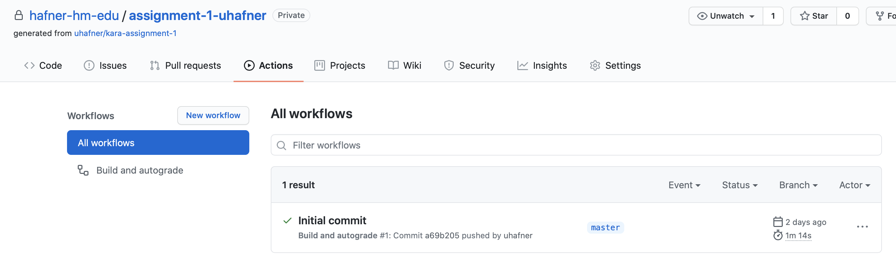
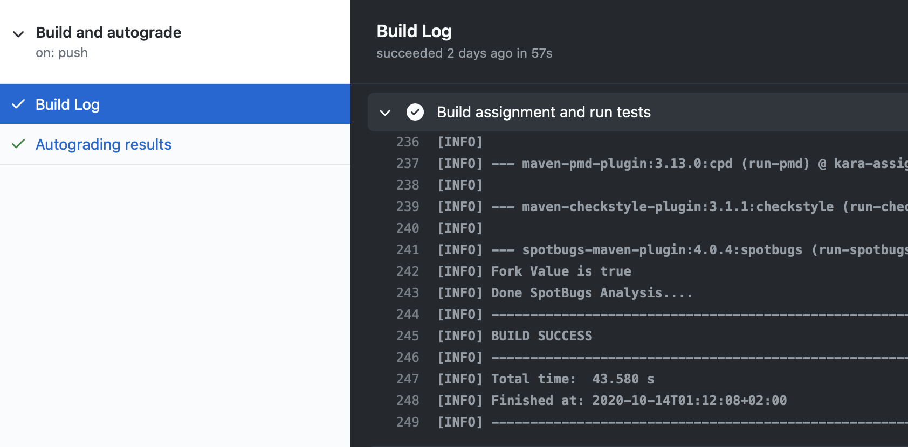
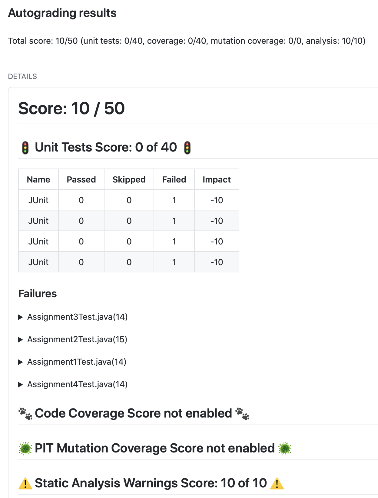

# Hinweise zu Abgaben zu meinen Veranstaltungen an der Hochschule München

In den folgenden Abschnitten ist die Abgabe von Lösungen zu meinen Veranstaltungen über GitHub Classroom beschrieben.

## GitHub Classroom

Für Abgaben zu allen meinen Veranstaltungen benutze ich aktuell GitHub Classroom: GitHub Classroom bietet Studierenden **und** Lehrenden eine einfache Möglichkeit, Aufgaben für Praktika in einem Git Projekt zu verwalten. Die Nutzung bietet folgende Vorteile:
- Sie lernen die gleiche Arbeitsweise kennen, die auch in der Industrie und vielen Open-Source-Projekten verwendet wird. So sind Sie ideal auf die Praxis vorbereitet. Ich nutze beispielsweise GitHub seit mehr als 10 Jahren für meine [Jenkins Open Source Plugins](https://plugins.jenkins.io/ui/search?query=uhafner).
- Sie haben eine ausgereifte Oberfläche, mit der Sie Ihre Abgaben verwalten können:
    - Darstellung von Commits
    - Reviews von Pull Requests
    - Nachverfolgung von offenen Punkten und Fehlern
    - Automatische Builds
    - Automatische Sicherung durch Backups
- Ich habe eine einfache Möglichkeit, private Repositories auf Basis eines Templates für Abgaben zu erstellen. Die Aufgaben können sowohl als Einzel- oder Teamaufgabe konzipiert sein. Die Steuerung der Berechtigungen erfolgt automatisch.

Eine Voraussetzung zur Nutzung von GitHub in unserer Veranstaltung ist das Anlegen eines entsprechenden [Accounts](https://github.com/signup?source=login). Haben Sie bereits einen GitHub Account, können Sie diesen gerne weiter verwenden. 

Anschließend treten Sie den einzelnen Classrooms bei, indem Sie ein von mir jeweils versendetes bzw. in Moodle hinterlegtes Link auswählen. I.A. erstelle ich pro Abgabe einen eigenen Classroom. In fortgeschrittenen Semestern gibt es aber auch Classrooms, die über mehrere Abgaben verwendet werden.

Über jeden Classroom bekommen Sie (oder Ihr Team) dann ein eigenes Git Repository, indem Sie alle Dateien (Dokumente, Programmtexte, etc.) Ihrer Abgaben hinzufügen. Im ersten Semester können Sie zum Hochladen die GitHub Oberfläche nutzen. Je erfahrener Sie werden, umso schneller können Sie den direkten Zugang über die Versionsverwaltung Git nutzen, das macht dann vieles einfacher und komfortabler.  

Wenn Sie weitere Fragen zu GitHub Classroom haben, nutzen Sie bitte auch die [Online Hilfe](https://classroom.github.com/help). Fragen können Sie auch direkt im Praktikum (oder im jeweiligen RocketChat Kanal der Veranstaltung) stellen.

## Autograding

Im Laufe Ihres Studiums lernen Sie in meinen Lehrveranstaltungen, dass Softwareentwicklung auch ein Handwerk ist, auf das man stolz sein kann. Damit Sie das erreichen, ist es wichtig, nicht nur auf Funktionalität, sondern auch auf Qualität zu achten. In meinem [Coding Style](https://github.com/uhafner/codingstyle) versuche ich, die dazu aus meiner Sicht wichtigsten Elemente vorzustellen. Damit das nicht nur trockene Theorie bleibt, haben Sie die Möglichkeit, Ihre Abgaben automatisiert von verschiedenen Tools bewerten zu lassen. So bekommen Sie ein schnelles Feedback zu Ihrer Lösung: 
- Haben Sie bzw. Ihr Team alle Dateien korrekt hochgeladen, sodass alles ohne Fehler übersetzt werden kann?
- Ist ihr Ergebnis richtig? D.h. besteht ihr Code die von mir vorgegebenen Tests?
- Hält sich Ihr Code an den vorgegebenen Styleguide?
- Enthält Ihr Code Bugs oder mögliche Fehlerquellen?
- Haben Sie Ihren Code ausreichend getestet?

Diese Überprüfung - im Folgenden *Autograding* genannt - erfolgt auf einem Rechner in der Hochschule. Dieser Rechner lauscht auf alle Classroom Projekte in GitHub: sobald ein neuer Commit entdeckt wird (d.h. Sie haben eine Änderung an einer Ihrer Dateien hochgeladen), werden diese Änderungen abgeholt und Ihr Projekt wird analysiert. Nach der Analyse werden die Ergebnisse in Ihrem Projekt veröffentlicht (und je nach Veranstaltung) auch in Punkte umgerechnet, die in die Bewertung Ihrer Abgaben eingehen. In meiner Lehrveranstaltung Softwareengineering lernen Sie, dass diese Vorgehensweise inzwischen State-of-the-Art in Industrieprojekten ist: dort wird diese Technik *Continuous Integration* und *Continuous Deployment* genannt.

Die Analyse im *Autograding* umfasst folgende Schritte: 

1. Ihr Projekt wird kompiliert. Das ist prinzipiell das gleiche wie in Ihrer Entwicklungsumgebung. Hier überprüft der Java Compiler, ob Sie sich an die Syntax der Sprache Java halten. Haben Sie hier einen Fehler in Ihrer Lösung, dann bricht hier die Verarbeitung mit einer Fehlermeldung ab. Prüfen Sie daher vorher lokal, ob Ihr Projekt fehlerfrei ist. Das können Sie auf der Console über das Tool *Maven* erreichen, indem Sie das Kommando `mvn clean compile` aufrufen. Am Ende der Verarbeitung sollte das Maven mit `[INFO] BUILD SUCCESS` bestätigen.
2. Automatisierte Tests zu den Aufgaben werden ausgeführt. Zu jeder Abgabe habe ich einen oder mehrere Tests verfasst, die Ihre Lösung prüfen. Diese Tests zeigen, ob Sie an alle Fallstricke gedacht haben. Auch diese Verarbeitung können Sie lokal prüfen, indem Sie das Kommando `mvn clean test` ausführen.
3. Ihre Klassen werden einer statischen Analyse unterzogen: dabei untersuchen verschiedene Tools Ihre Abgaben auf
typische Programmierfehler und auf die Einhaltung meiner [Kodierungsrichtlinien](https://github.com/uhafner/codingstyle). Zum lokalen Starten dieser Analyse müssen Sie das Kommando `mvn clean verify` ausführen.
4. Falls Sie eigenen Tests geschrieben haben: Wie gut ist die Qualität dieser Tests? Haben Sie alle Zeilen oder Zweige Ihres Codes benutzt (technisch: *Line und Branch Code Coverage*)? Finden Ihre Tests Fehler, wenn Ihr Programm von mir mutwillig sabotiert wird (technisch: *Mutation Coverage*)? Zum lokalen Starten dieser beiden Analysen müssen Sie das Kommando `mvn clean verify` (für die Code Coverage) bzw.  `mvn org.pitest:pitest-maven:mutationCoverage` (für die Mutation Coverage) ausführen.

Für technisch Interessierte: Damit das ganze funktioniert, benötigt es einen [GitHub Action Workflow](https://raw.githubusercontent.com/uhafner/autograding-github-action/main/.github/workflows/autograding.yml), der das Projekt kompiliert und dann mit meiner [Autograding Github Action](https://github.com/uhafner/autograding-github-action) anreichert. Diese Action ist Open Source und kann gerne auch in anderen Projekte verwendet werden.

Die Ergebnisse dieser Schritte können Sie für Ihre Abgaben sehr einfach nachvollziehen, indem Sie den Karteireiter *Actions* in Ihrem GitHub Projekt öffnen. Dort finden Sie für jedes neue Hochladen (d.h. technisch gesehen für jeden Commit) eine auswählbares Link, das zu den Ergebnissen führt.
 

Wenn neben dem Commit ein grüner Haken (✅) angezeigt wird, haben Sie Schritt 1 schon mal erfolgreich absolviert: Ihr Programm kompiliert fehlerfrei. Bei einem roten Kreuz (❌) müssen Sie den Fehler beheben und nochmal neu hochladen. Eine Abgabe, die nicht übersetzbar ist, wird automatisch mit 0 Punkten bewertet. Die Fehlermeldungen des Java Compiler sind manchmal für Neulinge etwas kryptisch, meist steht aber Zeilennummer und Ursache dabei, sodass das Problem hoffentlich schnell zu finden ist. Wenn nicht, wenn Sie sich an uns im Chat oder Praktikum, dann bekommen Sie auch dort Hilfe.

Die Ergebnisse der Schritte 2 bis 4 (und damit die eigentlichen Punkte Ihrer Abgabe) können Sie durch die Detailansicht des jeweiligen Commits einsehen. Dazu müssen Sie erst in die Detailsicht navigieren. Von dort haben Sie Zugriff auf das Ergebnis des Java Compilers. Dort müssen Sie nur hineinschauen, falls Sie hier ein rotes Kreuz sehen. Diese Ausgabe können Sie auch lokal über Maven erhalten (siehe oben):

Das wichtigste Ergebnis für die Abgabe ist dann die Zusammenfassung aus dem Autograding. Dort sehen Sie eine Punktezahl für die jeweilige Abgabe. Die Punkte berechnen sich aus den jeweils konfigurierten Bestandteilen: aus den Testergebnissen (Anzahl der Testfehler), aus den Warnungen der statischen Analyse und (falls konfiguriert) aus der Coverage Ihrer Testfälle. In den ersten Abgaben starten wir mit einer festen Punktezahl, von der jeweils Punkte bei Testfehlern oder bei Warnungen abgezogen werden. Im späteren Verlauf kann das auch umgekehrt funktionieren: also Start bei 0 und jeder erfüllte Test bekommt Pluspunkte.

Bei Testfehlern wird die Ausgabe der Tests direkt unter den Testpunkten als ausklappbarer Text angezeigt. Bei den Warnungen erhalten Sie gezieltes Feedback direkt als Markierung innerhalb des Quelltextes. 
 

