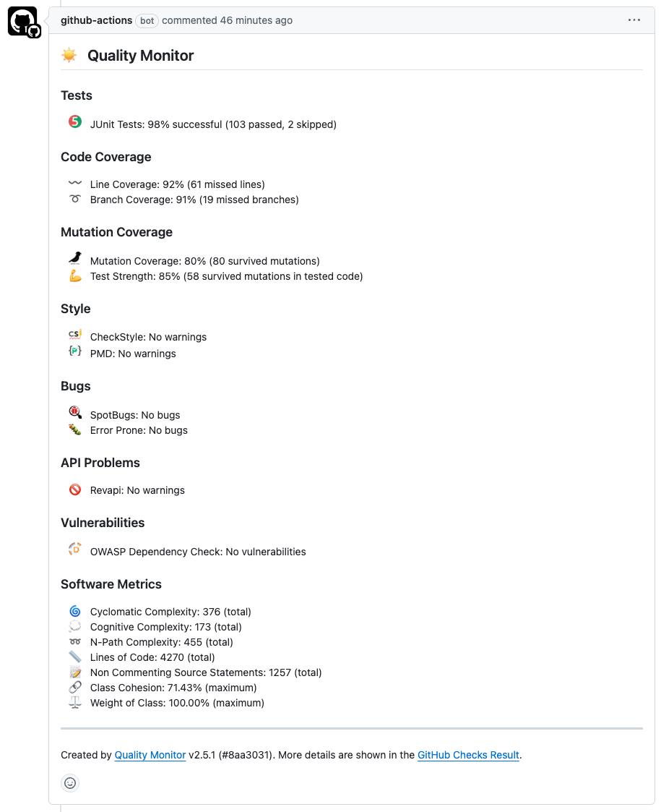

# Continuous Integration des Coding Style

Gemäß dem Grundsatz **eat your own dogfood** ist dieser Coding Style bereits für die Continuous Integration in [GitHub Actions](https://github.com/features/actions), [GitLab CI](https://docs.gitlab.com/ee/ci/) und [Jenkins](https://jenkins.io) vorbereitet. 

## Maven Konfiguration

Sowohl für GitHub Actions als auch für Jenkins erfolgt die Automatisierung des Builds über Maven. 
Im zugehörigen [POM](../pom.xml) sind alle Versionen der benutzten Maven Plugins und der benötigten Abhängigkeiten über Properties definiert, d. h. eine Aktualisierung lässt sich im entsprechenden Abschnitt leicht selbst durchführen bzw. wird über den [Dependabot](https://dependabot.com) Roboter von GitHub automatisch über einen Pull Request aktualisiert. 
U. a. sind die folgenden Plugins vorkonfiguriert:
- maven-compiler-plugin: konfiguriert die Java Version auf Java 17 und legt alle Error Prone Regeln fest. Die Java Version kann beliebig aktualisiert werden. 
- maven-javadoc-plugin: aktiviert die strikte Prüfung von JavaDoc Kommentaren
- maven-jar-plugin: legt einen Modulnamen fest. Außerdem wird ein test-jar konfiguriert, sodass alle Tests (und abstrakte Testklassen) auch als Dependencies genutzt werden können.
- maven-pmd-plugin: prüft das Projekt mit [PMD](https://pmd.github.io/), die Regeln liegen in den Dateien [pmd-java-configuration.xml](../etc/pmd-java-configuration.xml), [pmd-tests-configuration.xml](../etc/pmd-tests-configuration.xml) und [pmd-javascript-configuration.xml](../etc/pmd-javascript-configuration.xml).
- maven-checkstyle-plugin: prüft das Projekt mit [CheckStyle](https://checkstyle.sourceforge.io/), die Regeln liegen in den Dateien [checkstyle-java-configuration.xml](../etc/checkstyle-java-configuration.xml) und [checkstyle-tests-configuration.xml](../etc/checkstyle-tests-configuration.xml).
- spotbugs-maven-plugin: prüft das Projekt mit [SpotBugs](https://spotbugs.github.io/), alle Regeln werden verwendet mit den Ausnahmen definiert in der Datei [spotbugs-exclusion-filter.xml](../etc/spotbugs-exclusion-filter.xml).
- revapi-maven-plugin: prüft, ob die aktuelle Versionsnummer die [semantische Versionierung](https://semver.org) berücksichtigt (source and binary). D.h. es gilt:
    1. Eine neue **Major** Version wurde definiert, wenn das API nicht mehr abwärtskompatibel ist.
    2. Eine neue **Minor** Version wurde definiert, wenn eine neue Funktionalität abwärtskompatibel hinzugefügt wurde.
    3. Eine neue **Patch** Version wurde definiert, wenn Fehler abwärtskompatibel behoben wurden.
- maven-surefire-plugin: aktiviert das Erkennen der Annotationen der Architekturtests mit [ArchUnit](https://www.archunit.org)
- jacoco-maven-plugin: misst die Code Coverage der Testfälle mit [JaCoCo](https://www.jacoco.org)
- pitest-maven: misst die Mutation Coverage der Testfälle mit [PITest](http://pitest.org)

## GitHub Actions

Die Konfiguration der Continuous Integration in GitHub Actions ist sehr [einfach](../.github/workflows/ci.yml) über eine Pipeline möglich. 
Da der gesamte Build über Maven automatisiert ist, besteht die Pipeline eigentlich nur aus einem Maven Aufruf, der das Projekt baut, alle Tests (Unit und Integrationstests) ausgeführt, die statische Code Analyse durchführt und schließlich die Coverage misst. 
GitHub Actions bietet auch die Möglichkeit, Matrix Builds durchzuführen: D. h., der Build wird z. B. auf den Plattformen Linux, Windows und macOS oder mit den Java-Versionen 21 und 25 parallel durchgeführt. 
Ein Beispiel für die Konfiguration eines Matrix Builds ist in der Datei [ci.yml](../.github/workflows/ci.yml) zu finden.

Wenn gewünscht, können die Ergebnisse der statischen Codeanalyse und der Code Coverage Tools auch direkt im Commit oder Pull-Request angezeigt werden. 
Dazu muss in der Pipeline meine [Quality Monitor Action](https://github.com/uhafner/quality-monitor) aktiviert werden. 
Eine Beispielkonfiguration ist in den Dateien [/quality-monitor-build.yml](../.github/workflows/quality-monitor-build.yml) und [quality-monitor-comment.yml](../.github/workflows/quality-monitor-comment.yml) zu finden, das Ergebnis in der nachfolgenden Abbildung:

## Jenkins

Eine Beispielintegration mit Jenkins ist auch bereits vorhanden. 
Diese ist im [Jenkinsfile](../Jenkinsfile) hinterlegt und startet die Integration in mehreren Schritten (Stages). 
Zunächst werden auch hier alle Schritte wie in GitHub Actions aufgerufen. 
Anschließend erfolgt noch ein Start der Mutation Coverage mit [PIT](http://pitest.org). 
Insgesamt ist die CI-Konfiguration für Jenkins umfangreicher, da nicht nur der eigentliche Build konfiguriert wird, sondern auch die Darstellung der Ergebnisse im Jenkins UI über die entsprechenden Jenkins Plugins konfiguriert wird. 

### Lokale CI in Jenkins (über Docker Compose)

Da es für Jenkins keinen öffentlichen Service wie bei GitHub Actions gibt, um eigene Projekte zu bauen, muss die Jenkins Integration lokal auf einem Team-Server durchgeführt werden. 
Zur Vereinfachung des Jenkins Setup ist in diesem Coding Style eine lauffähige Jenkins Installation enthalten (im Sinne von *Infrastructure as Code*). 
Diese kann über `bin/jenkins.sh` gestartet werden. 
Anschließend wird die aktuelle Jenkins LTS Version mit allen benötigten Plugins in einem Docker Container gebaut und gestartet (das dauert beim ersten Aufruf etwas). 
Dazu wird ebenso ein als Docker Container initialisierter Java Agent verbunden, der die Builds ausführt.

<!-- markdown-link-check-disable-next-line -->
Nach einem erfolgreichen Start von Jenkins sind dann unter [http://localhost:8080](http://localhost:8080) mehrere Jenkins Jobs sichtbar. 
Einer dieser Jobs baut das vorliegende Coding Style Projekt. 
Der Zugang auf diesen lokalen Rechner erfolgt zur Vereinfachung mit Benutzer `admin` und Passwort `admin`, anschließend hat man volle Jenkins Administrationsrechte. 
Die jeweiligen Jobs müssen danach manuell gestartet werden, die Ergebnisse der Tests, Code und Mutation Coverage sowie der statischen Analyse werden dann automatisch visualisiert. 
Das Jenkins Home Verzeichnis ist im Docker Container als externes Volume angelegt: d.h. der Zugriff kann auf dem Host direkt im Verzeichnis `docker/volumes/jenkins-home` erfolgen.

Nach einem ersten Build in Jenkins sollte sich dann in etwa folgendes Bild ergeben:

